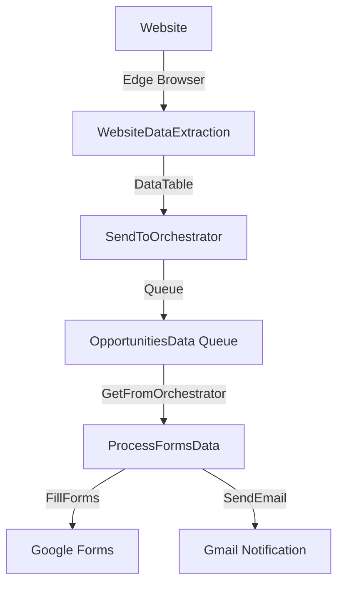
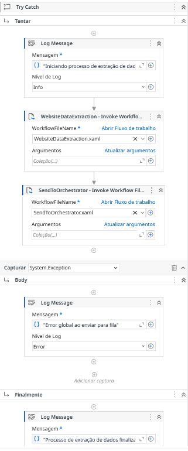
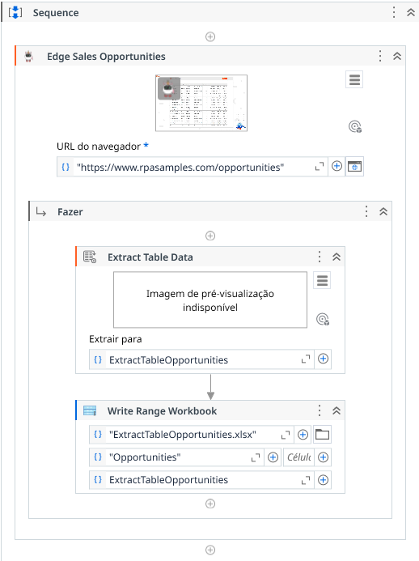
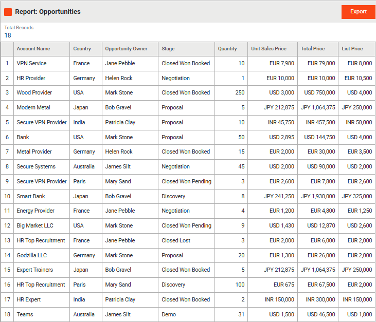
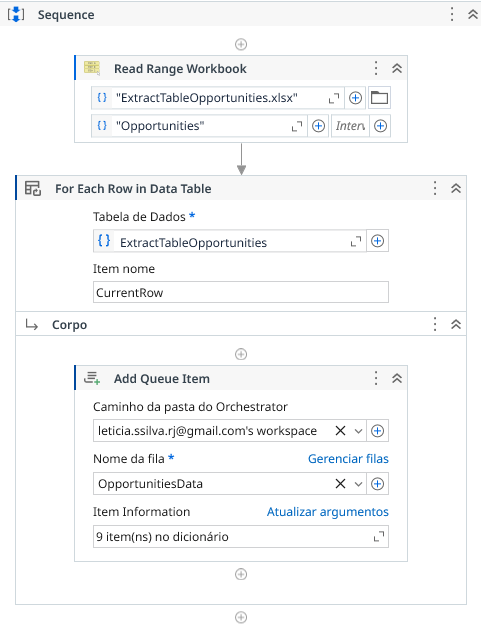
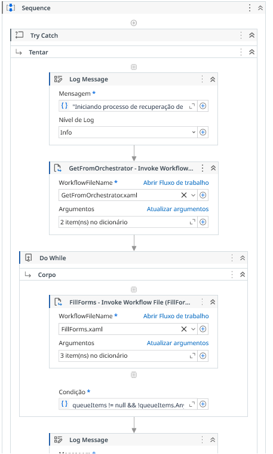
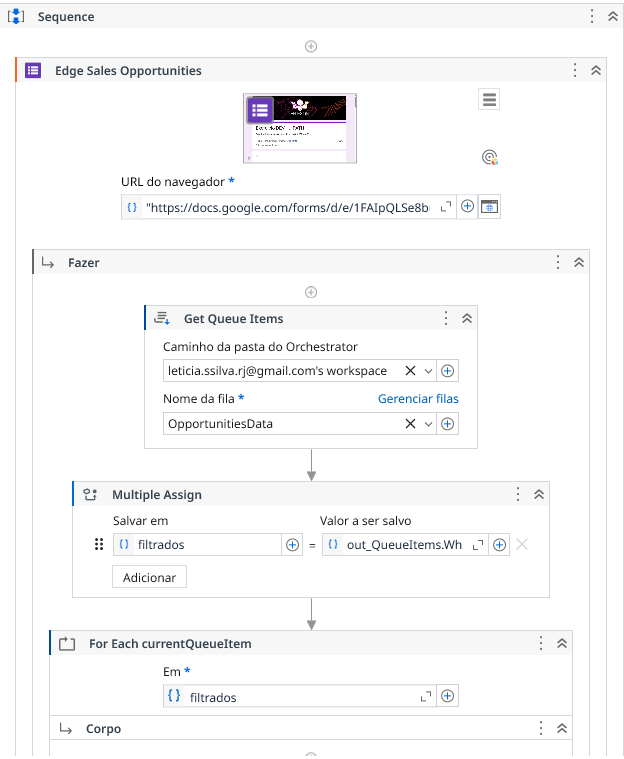
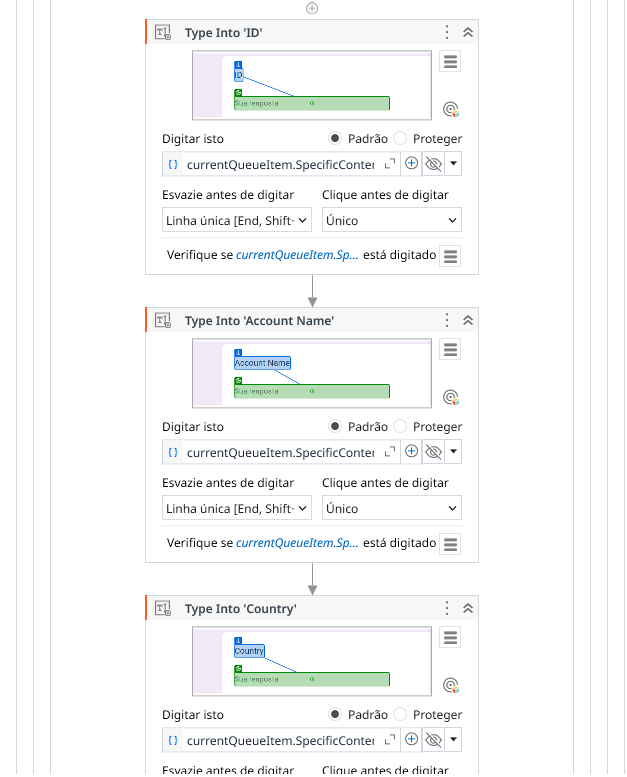
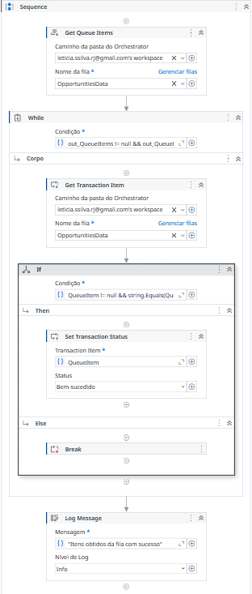
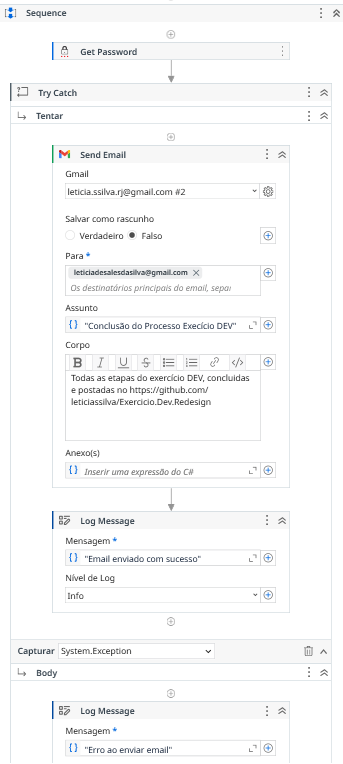

# Documentação Técnica 🔧

## Sumário 📑
1. [Estrutura do Projeto](#estrutura-do-projeto)
2. [Organização do Código](#organização-do-código)
3. [Arquitetura do Sistema](#arquitetura-do-sistema)
4. [Fluxo de Dados](#fluxo-de-dados)
5. [Processo Detalhado](#processo-detalhado)
6. [Dependências](#dependências)
7. [Configurações Técnicas](#configurações-técnicas)
8. [Tratamento de Erros](#tratamento-de-erros)
9. [Performance](#performance)
10. [Segurança](#segurança)
11. [Manutenção](#manutenção)
12. [Galeria de Imagens do Processo](#galeria-de-imagens-do-processo)

## Estrutura do Projeto

```
Exercicio.Dev.Redesign/
├── ExtractionSalesOpportunities/    # Módulo de extração de dados
│   ├── Main.xaml                    # Orquestrador principal
│   ├── WebsiteDataExtraction.xaml   # Extração do site
│   ├── SendToOrchestrator.xaml      # Envio para fila
│   ├── project.json                 # Configurações do projeto
│   ├── project.uiproj               # Projeto UiPath
│   └── entry-points.json            # Pontos de entrada
│
├── ProcessFormsData/                # Módulo de processamento
│   ├── Main.xaml                    # Controlador principal
│   ├── GetFromOrchestrator.xaml     # Recuperação da fila
│   ├── FillForms.xaml              # Preenchimento de formulários
│   ├── SendEmail.xaml              # Notificações por email
│   ├── project.json                # Configurações do projeto
│   ├── project.uiproj              # Projeto UiPath
│   └── entry-points.json           # Pontos de entrada
│
├── Imagens/                        # Recursos visuais e capturas
│   └── [capturas de tela e diagramas]
│
├── README.md                       # Documentação principal
├── technical_doc.md                # Documentação técnica
└── LICENSE                         # Licença do projeto
```

### Organização do Código

1. **ExtractionSalesOpportunities**
   - Módulo independente de extração
   - Foco em UI Automation e coleta de dados
   - Integração com Edge Browser

2. **ProcessFormsData**
   - Módulo de processamento e preenchimento
   - Gerenciamento de filas do Orchestrator
   - Integração com Google Forms e Gmail

3. **Imagens**
   - Capturas de tela do processo
   - Diagramas de fluxo
   - Recursos visuais para documentação

4. **Documentação**
   - README.md: Visão geral e guia rápido
   - technical_doc.md: Detalhes técnicos

## Arquitetura do Sistema

### ExtractionSalesOpportunities 📊
- **Main.xaml**: Orquestrador principal do processo de extração
- **WebsiteDataExtraction.xaml**: Extração de dados do site usando UI Automation
- **SendToOrchestrator.xaml**: Envio dos dados para fila do Orchestrator

### ProcessFormsData 📝
- **Main.xaml**: Controlador principal do processo de formulários
- **GetFromOrchestrator.xaml**: Recuperação de dados da fila
- **FillForms.xaml**: Automação de preenchimento de formulários
- **SendEmail.xaml**: Notificação por email do processo

## Fluxo de Dados

### Diagrama de Fluxo 📊



### Processo Detalhado

1. **Extração**
   - Acessa website via Edge Browser
   - Extrai dados usando UiPath UI Automation
   - Estrutura dados em DataTable
   - Envia para fila "OpportunitiesData"
   
2. **Pontos de Integração**
   - Edge Browser para acesso web
   - UiPath Orchestrator para filas
   - Google Forms para formulários
   - Gmail para notificações

3. **Controle de Fluxo**
   - Validações em cada etapa
   - Logs de progresso
   - Tratamento de exceções
   - Notificações de status

2. **Processamento**
   - Recupera itens da fila
   - Processa cada item individualmente
   - Preenche formulário Google Forms
   - Atualiza status na fila
   - Envia email de notificação

## Dependências

```json
{
  "UiPath.Excel.Activities": "[3.2.1]",
  "UiPath.GSuite.Activities": "[3.4.10]",
  "UiPath.Mail.Activities": "[2.4.10]",
  "UiPath.System.Activities": "[25.10.0]",
  "UiPath.Testing.Activities": "[25.10.0]",
  "UiPath.UIAutomation.Activities": "[25.10.16]"
}
```

## Configurações Técnicas

### Orchestrator
- **Fila**: OpportunitiesData
- **Assets**: Credenciais Gmail
- **Folder**: leticia.ssilva.rj@gmail.com's workspace

### Email
- **Serviço**: Gmail via GSuite Activities
- **Template**: HTML com link para repositório
- **Tratamento de Erros**: Try-Catch com logs

## Tratamento de Erros

1. **Níveis de Log**:
   - Info: Progresso normal
   - Error: Falhas no processo

2. **Estratégias**:
   - Try-Catch em operações críticas
   - Logs detalhados de erros
   - Notificação por email em falhas

## Performance

- Processamento item a item
- Retry automático em falhas de rede
- Timeout configurado para operações

## Segurança

- Credenciais armazenadas no Orchestrator
- Senhas nunca expostas no código
- Logs excluem dados sensíveis

## Manutenção

### Pontos de Atenção
- Atualizar seletores UI em caso de mudanças no site
- Verificar versões de dependências
- Monitorar logs de erro no Orchestrator

### Melhorias Futuras
- Implementar relatórios detalhados
- Adicionar dashboards de monitoramento
- Expandir validações de dados

## Galeria de Imagens do Processo

### 1. Extração de Dados 🌐

#### Website de Oportunidades


*Fluxo principal*
- Componente: main.xaml

#### Website de Oportunidades


*Página de oportunidades de vendas no navegador Edge*
- URL: https://www.rpasamples.com/opportunities
- Componente: WebsiteDataExtraction.xaml

#### Extração da Tabela


*Processo de extração de dados da tabela*
- Atividade: Extract Table Data
- Destino: ExtractTableOpportunities.xlsx

#### Gerenciamento da Fila


*Enviando para a fila OpportunitiesData*
- Criando O Arquivo Excel
- Add Queue Item

### 2. Processamento de Formulários 📝

#### Website de Oportunidades


*Fluxo secundário*
- Componente: main.xaml

#### Google Forms


*Interface do formulário de processamento*
- URL: https://docs.google.com/forms/d/e/1FAfpQLSe8b
- Componente: FillForms.xaml

#### Preenchimento Automático


*Automação do preenchimento de campos*
- Type Into Activities
- Validações de campos
- Tratamento de erros

### 3. Integração com Orchestrator 🔄

#### Fila de Processamento


*Gerenciamento da fila OpportunitiesData*
- Get Queue Items
- Get Transaction Item
- Set Transaction Status

### 4. Notificações por Email 📧

#### Template de Email


*Modelo de email de notificação*
- Conclusão do Processo
- Links para resultados
- Detalhes da execução
- Status de envio
- Tratamento de erros
- Confirmações